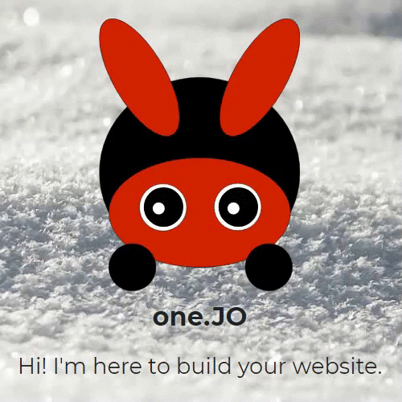

# one.JO
one.JO - Second project about a fictional web development company using advanced CSS and a little bit of JavaScript.

Check it out in action <a href="https://onejo.eu/" target="_blank">here</a>.

Main features:
  - Dark/Light Mode: Switchable button and automatic mode according to CEST(Day/Night).
  - Back top button only appears on scroll.
  - Sticky Footer with Flexbox design.
  - Cookies alert.
  - Logo eyes mouse movement using JS.
  - Advanced CSS3 tools.
  - Organized in php files.
  - Text typing effect and active links with JS.
  - Font: Montserrat
  - Error 404 page
